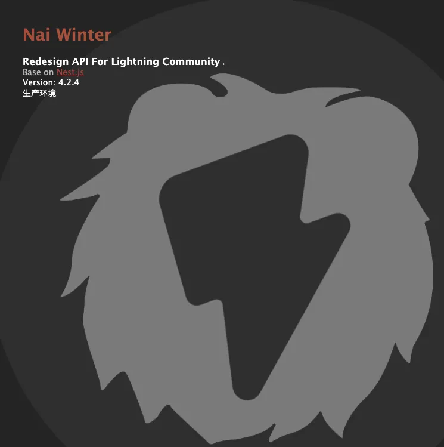
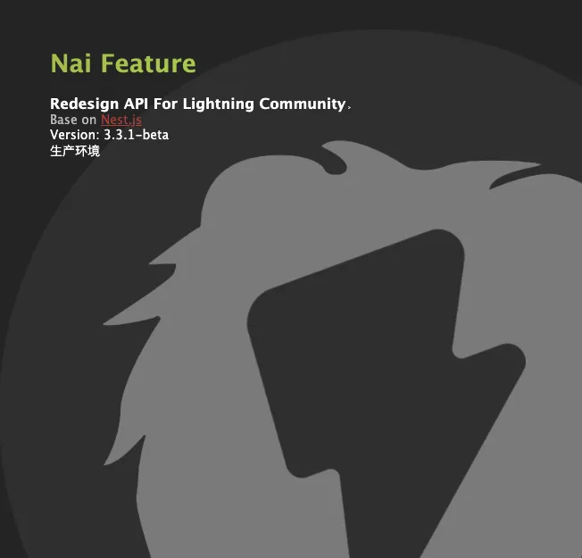
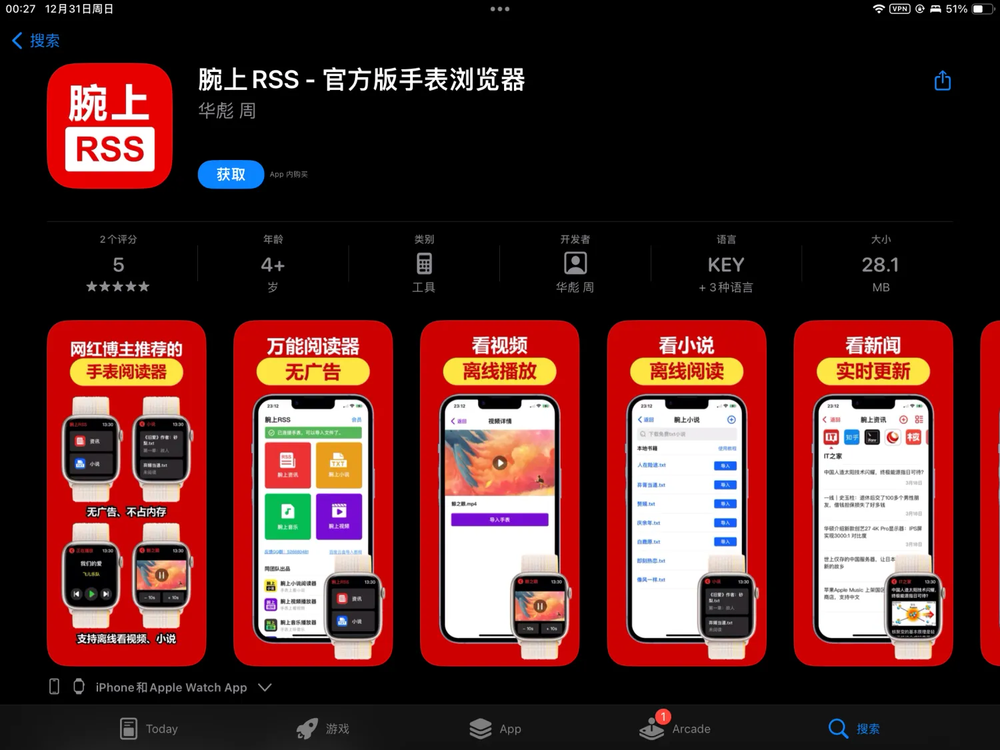
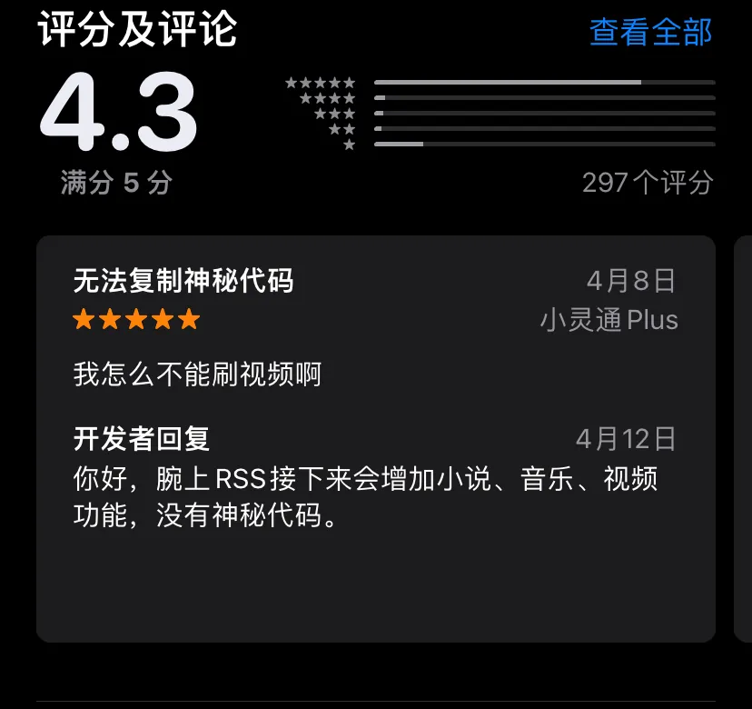
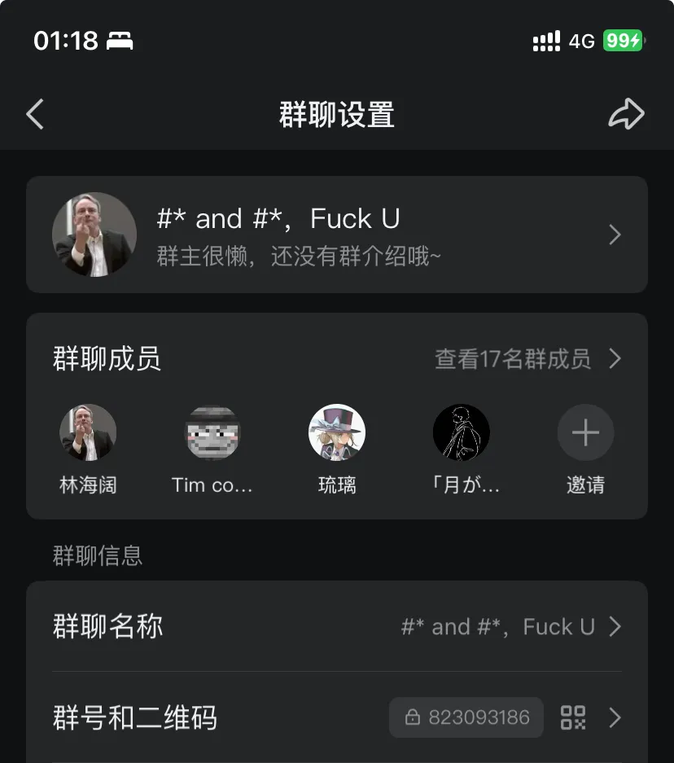
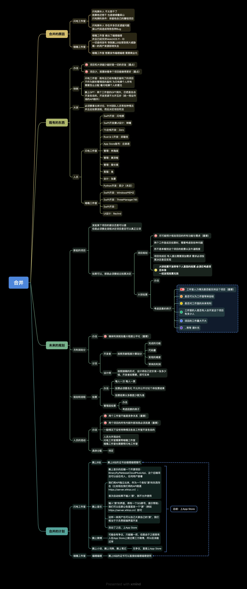

> 始撰于 2023 年 12 月 17 日。有疏漏，请提PR指正。

我似乎就是这样的，没点事情做，闲不下来。2022 年，是最难过的一年。疫情，疫情，很多人天天看戏，吃席。 2020 年的疫情，仿佛还是去年。这三年时间怎么就这么快过了呢？猛回头，都不知道干了些啥。后疫情时代，似乎人人都处在一种怅然若失的状态中。 2020 年发生的一堆事，似乎若然看到了一些端倪。似乎这个时候，才是我接触人情世故真正的开始。 现在看来我还是怕了许多；主要是本来时间也少，便不想去再扯这些事情了。但是，2022 年秋，仅是在群里水了一句话，便又被扯入似噩梦又似辉煌的人情世故。

## 2022

大概就`2022年9月`，我买了我人生第一台真正意义上的 Apple watch。是一台 4 代的二手。 这是我一直梦寐以求的，最早可以追溯到初三的时候。那时，就想整一台来玩玩。 高二的时候，分班，和`涛`相识，他手上就有一台 Apple watch Series 3。本来我当时已经没有再想买 Apple watch 的，但是第一次接触了之后，基本上被 Apple 的设计折服。 当时我有一个小米手环 6，是我妈买的，（虽然不能与 Apple watch 相比）确确实实是和初三的时候一样，被 Apple watch 的设计吸引到了。各种动画，设计的精致，以及各种小细节，直接让一个土狗撕开了眼界。 当时我就想，等我有钱了，一定要买一台 Apple watch。这时候还是高二上学期，于是便想着，如何变着法子赚钱。

### 网络上

#### 折腾博客

20 年年底的时候，确实是闲着慌，折腾 wordpress 生态，折腾各种博客，折腾各种网站。这时候，我就想，要不要做一个网站，通过放广告、SEO 等等来赚钱。只能说，当时还是太幼稚了。这类基本上需要`大量的投资`，而我哪来？一穷二白的，哪里有钱投资？ 但是我当时还是学到了一堆东西，比如说：

##### 搭建网站

- 买域名
- 虚拟主机，VPS，物理机的区别
- 折腾 cloudflare CDN 自选 IP，各大云厂商的 CDN，服务器，等等
- 宝塔面板全家桶，nginx，mysql，php，redis，memcached，ftp 服务器，等等

##### 搞 wordpress 博客

- wordpress 的安装
- 插件
- 主题
- SEO

再多的，我以后再开一篇文章来写写，这里的重点不在这，只在于以我的视角铺垫。 到 21 年年底，饱腹`低级运维经书`，然后转移阵地，跑去折腾`php`。这时候，在我眼里，`硬技术最牛逼，只要有技术，哪里都能走`的思想，已经在我的脑海里开始成形了。

#### 折腾黑苹果

其实黑苹果这块，我也是折腾了很久的。我印象中从苹果发布 `macOS mojave` 版本开始折腾的。一开头，我是先使用`vmware`虚拟机装了一个，但是没有驱动，卡的要命，后面才想着去搞一个双系统的黑苹果，玩一玩。 当时初三刚毕业，时间很多，很充裕，基本上折腾了一整个暑假，终于装上了`MacOS mojave`，当时装上之后实在是开心的不得了了😂我到现在还记得那天我的心情，这可能就是折腾的快乐吧🎉

> 以后或许会开一篇讲讲黑苹果生涯，）放个坑在这先。

### 现实中

#### 拍视频

这个是我最早的想法。我们这代人，只要是想搞钱的，估计都有这种想法吧。毕竟移动网络世界是从我们这一代开始绽放的。 但是搞这个，和大多数人一样，一样是失败了。基本上，也就是和芸芸众生那样，拍了几个视频，就歇菜了。因为各种原因。 而且，现在回去看这些视频，完完全全的就是`黑历史`啊，天。

#### 闲鱼

高二，16 周岁终于到了。于是马不停蹄地，开始折腾起了`闲鱼`。 我的本钱，是砸锅卖铁出来的。家里的烂显卡，用不上的旧硬盘，各种之前换电脑遗留下来的圣遗物，都被我拿出来卖了出去。 我到现在还记得，本钱大概总共`200`块钱左右。 于是开始买卖。从 iPhone 5 开始，历经 iPhone 5，iPhone 6、iPhone 6s、iPhone SE，iPhone 7、iPhone X，结束于此。这是我的闲鱼`倒卖`之旅。 其中 iPhone 6s 是倒卖的最多的，也是苹果历年来性价比最顶级的产品（哪怕是目前，也一样）。当时又积累了一些二手的知识，诸如`卡贴机`哇，`id机`哇，`黑解机`哇，`绕激活锁`哇，各种杂七杂八的东西。 iPhone 6s 也确实是一部非常强的苹果设备。再往 iPhone 6s 里面塞多点运存，再多点电池容量，基本上都可以媲美我现在用的 iPhone 11，哈哈哈 😂 现在回想起来也是挺不容易的。我是午宿生，为了省钱，天天中午吃饭都是`泡面`，`泡面`，省一餐是一餐，省一分钱是一分钱。基本上买Apple watch的钱都是省出来的。 换了不知道多少台手机，最后才一气呵成买到了一台`黑解`的`iPhone X`。然后接着继续省钱，到了22年9月，才终于终于买到了我的那台`Apple watch S4`，正式入坑Apple watch圈。

## 不知道是噩梦的开始还是梦的开始

噩梦也算不上；梦，也算不上。 `2022年9月`，我收到快递的那一刻，激动得不行。 过了几天，就想玩一些新花样在这手表上了。 人，总是不能被永久满足的动物。 在我的印象中，以前在B站刷到过安卓`腕上哔哩`，可以在手表上刷B站。当时我就在想，会不会`watchOS`上也有人做呢？一搜，确实有，于是就开坑了。 因为是`testflight`，所以我在安装好`腕上B站`之后，立马就扫码进了`闪电工作室`的`腕上闲聊`QQ群。毕竟`testflight`这种东西是有到期时间的，所以加个群，以防走丢。 一开头仅仅只是这样的。没想到，事情往不可思议的方向发展了。

### 铁律

> 每年的7～10月，是人才辈出的时候，也是小工作室们最乱的时候。

这条铁律，2020年的事情过后，我就已经隐隐有点感觉到了，但是我不敢武断所有的工作室，毕竟我觉得，人的见识永远都在增长，瞎定义东西，当定律不管用的时候，总会遭人喷的。 闪电工作室，也差点糟在这个坑里，照样`逃不过去`。

### 一切的开始

2023年9月，既是`我买Apple watch`的时间，也是我进入`闪电工作室`的时间。万恶之源，就此开启。 我还记得我最初，只是在群里问了句：

> 闪电现在前端是怎么拿数据的？JSON传还是？

然后就被`闪电狮`搞进去了。自己也是莫名其妙。 说实话，我当时心里还是非常`没有底`的，因为当时我基本上就是一个`技术混子`，`php`也不精，`JavaScript`也不精，基本上就是个半废散人。能被搞进去，我自己也是有点懵逼的。 当时的闪电，大群就是`腕上闲聊群`，一开头群似乎只有几个，而且正值`9月份`，群内问题非常多，人也非常杂。当时的情况，因为我是新来的，所以至今我也不得了解事情的经过；实际上，就是几样离谱事情`揉搓在一起：`

#### 闪电狮打赌

和同学打赌，也不知道是打什么赌，筹码是群里的管理员；然后打`输`了，就让他同学做了管理；然后他同学乱踢人，导致老管理员们引发非议，当时还特意搞了一个群，讨论此事。闹了好几天，之后我把`闪电狮`拉入非议群，`闪电狮`才如实向我们坦白说出了打赌的事情。 当时就有很多`元老级的管理员`气的不打一处来，`退出`或`半退出`了工作室。 涉及到的人有很多，比如`黄泽楷`，`SOP`等人。

#### Darock成立

事情的一开始似乎很简单，以`Windows MEMZ`为代表的等人开发了一款`腕上充电`的App，想并入`腕上系列`，而且仅仅是借助下`闪电工作室`和`腕上系列`的名头。但是`闪电狮`等人当时的想法是`腕上充电`这款App并没有什么大的作用和创新点，所以并没有允许。 于是因为这个原因，`Darock Studio（暗礁工作室）`成立；似乎一开头并不是因为什么，只是MEMZ等几人不满意`闪电狮`的政策而已。

#### 闪电猫搞事

因为`腕上B站`这种类型的App是不可能能上`App Store`的，可能`闪电猫`等人和某些人产生了什么`矛盾冲突`和`网上口角`，后面局势闹僵之后，甚至向`苹果`和`B站官方`举报，但是`似乎没有任何回音`。 最主要的是在群里引起了很大的`舆论风波`，导致人人心不安；当时`闪电狮`又正值高二，每天晚上才有空，而且哪怕是有空，他也不会去处理群内的事情，他还是得去`搞开发`。

---

上面的三件事，实际上一起发生的；基本就在2022年的9～10月，也就是`我进闪电工作室的那个时候`。 这时候就已经印证了我上面那条`铁律`：

> 每年的7～10月，是人才辈出的时候，也是小工作室们最乱的时候。

### 11月，12月，1月

#### 心电社区

这个项目一开头是`邱璇洛`提出来的；但是提出来之后`石沉大海`，并没有任何人去实现。后面我来了，大致知道了这个`腕上生态的理念`后，便想着，正好我也刚开始学习`Node.js`，要不我来把`心电社区`给整出来。于是，和闪电狮说过之后，心电社区的`后端项目`正式开始了。 **只有我一个人。对，从始至终只有我一个人。** 于个人而言，我是想去探索`Node.js`这个生态圈，因为当时我已经知道了`php`这门语言在国内已经处在`语言鄙视链的最底层`；再去深入探究，似乎不太行了。于是，由`wordpress`圈转`前端`圈，至少也比`php`好不少。 心电社区的V1版本，我是用`Express`写的。直到目前（`2023年12月17日`），心电社区已经发展到V4版本，也算是把`Node.js`应用层的生态给捞了个遍。

##### V1版本

V1版本是非常之简单的，基本没有使用任何的大型中间件和技术栈，所以很快就被我重构了：

- Express框架外加基础的body-parser，cookie-parser等插件：[expressjs.com](https://expressjs.com)
- MySQL数据库
- 登录注册只使用了一个token鉴权

##### V2版本

V2版本就变得复杂多了；但是主框架还是用的Express，所以照样还是有很多的架构问题；一直到12月底，撑不住了，又被我重构了：

- Express框架外加基础的body-parser，cookie-parser等插件：[expressjs.com](https://expressjs.com)
- MySQL数据库
- Redis缓存数据库
- 登录注册只使用了一个token鉴权

##### V3版本

这个版本目前仍然还在服务器上运行着，因为太多的技术债，遗留了很多东西在里面，不得不继续跑着；但是大多数服务都已经被弃用了的。 这个版本可以说是完完全全`脱胎换骨`：底层框架还是`Express`，但是使用了上层框架`Nest.js`等：

- 主框架：`Nest.js` + `Express`，[nestjs.com](https://nestjs.com)
- 数据库：MySQL数据库 + `Sequelize`ORM框架
- 登录注册只使用了一个token鉴权
- `Swagger`文档 + `OPENAPI`

可以看到这个版本没有用到`Redis`。

##### V4版本

这个版本就是目前的版本，大概于`2023年4月`左右开始做的：

- 主框架：`Nest.js` + `Express`，[nestjs.com](https://nestjs.com)
- 主数据库：MySQL数据库 + `mysql2`驱动 + `TypeORM`ORM框架
- 缓存数据库：`Redis` + `ioredis`驱动
- 搜索数据库：`ElasticSearch`，大致于`2023年6月`加入
- 登录注册使用`JWT进行鉴权`
- `Swagger`文档 + `OPENAPI`
- `Monorepo` + `pnpm workspace`组织多包管理
- `prettier` + `eslint` + `husky`规范代码和Git提交
- `Vue3` + `Vite` + `Vue Router` + `Pinia`集成配置中心

可以说这个版本是非常完美的，各种`中间件`等，`buff`全齐了。

---

纵观整个`心电社区`，基本上就是我`Node.js`技术的进步史。

#### 支付系统

腕上B站大概在我进闪电工作室没多久的时候，就用`腕上RSS`伪装上架到了`App Store`，用户只要复制一串神秘代码：`LightningLion`就能进入到`腕上B站的首页`。直到`23年1月份`的时候，非常突然地被苹果发现，强制下架了。

##### 加急赶工

出了问题，便解决问题。当时我们就剩两条路：继续`Testflight`，或者`买企业证书`。

- `上Testflight`：当即我们试过了这个方案，但是并不行，很快又被苹果下架。基本上等于0；
- `买企业证书`：我们不得已只能选择这个方案。企业证书，便宜的，也得`两三百`；贵的，稳定的，得要`两三千三四千`，实在是不得已，现在走投无路了；于是，只能走`完全的商业化`了。

1星期内，我用`心电社区`的后端在2天内，上课的时候用手机写代码，对接了一个微信支付系统。当时心电社区还是`Nai Feature（即V3版本）`，对接了微信支付之后，因为没有做到真的很牛逼的架构设计，已经惨不忍睹；过了没多久，`Nai Winter（V4版本）`就启动了。

支付系统搞好之后，`腕上音乐`，`腕上小说`等APP马上就开始了收费的政策，买断制6块钱，算是非常便宜了。整个过程，大概花费了`1周`的时间，`腕上系列`才全面恢复。

##### 盗版RSS

在这`一周`的时间里，App Store没了我们的`腕上RSS`，用户都搜索不到了，就在这一周的空档里，`App Store`出来了一个盗版的`腕上RSS`。这个盗版的`腕上RSS`至今仍然在`App Store`上。

App Store链接：[https://apps.apple.com/cn/app/%E8%85%95%E4%B8%8Arss-%E5%AE%98%E6%96%B9%E7%89%88%E6%89%8B%E8%A1%A8%E6%B5%8F%E8%A7%88%E5%99%A8/id6446045433](https://apps.apple.com/cn/app/%E8%85%95%E4%B8%8Arss-%E5%AE%98%E6%96%B9%E7%89%88%E6%89%8B%E8%A1%A8%E6%B5%8F%E8%A7%88%E5%99%A8/id6446045433)

当时腕上B站还特意发了公告通知说这是盗版。但是看App Store评论，还是有人被骗下载购买了的。

这直接成为了下次`大乱斗事件`的源头。

### 逃不过铁律的7月

`23年7～10月`的群魔大乱斗，其实可以用一张PDF讲清楚整个脉络。

[点击查看 ⚡️.pdf](/static/lightning.pdf)

而接下来，我会根据这张PDF逐步捋清楚脉络。

#### 7月初

又是这个时候。没错，逃不过，根本逃不过。 一切的一切，都源于`Rechrd`。 接近7月初旬，`Rechrd`出现，从`ReX社区`过来，想加入`闪电工作室`做设计；因为`腕上B站`的`UI`本身就非常地`不行`；当时Rechrd加了闪电狮，但是闪电狮没有回复（⚡️🦁の经典操作）;估计是在`腕上闲聊群`等群发牢骚之后，了解到了`Darock`，因为`闪电狮`不回复，就到了`Darock`做设计，不怎么理`闪电狮`了。 Darock当时似乎本身就在摆弄一个玩具项目：自己做一个`腕上B站`。但是UI据说也是特别垃圾。而Rechrd来了之后，这个`Darock版本的腕上B站`的界面也是经过一番洗礼，加上`WatchOS10`，直接好看到起飞。这个`新腕上B站`的名字，就叫做`喵哩喵哩`。

#### 7月14日

这一天，因为群内对`闪电狮`不回信息等的恶习深恶痛绝的人越来越多，`林海阔`为群主，`Patch群`成立；之所以叫`Patch`群，因为当时`闪电工作室`和`Darock工作室`的人都被拉入了群内。 一开头，这个群起因本来就是`骂狮`，没有别的企图。但是后面，逐步成为了`两个工作室`沟通的桥梁。

#### 时间线外的华为

约在`2023年的5～6月`，闪电狮不知道在哪边探到了华为的人脉，准备想搞一个`纯鸿蒙腕上B站`。当时他就说过了，可以使用`JavaScript`开发，于是我便跃跃欲试。 试了没多久，发现鸿蒙的坑，实在是太多太多了。包括但不限于：

- CSS是`阉割版CSS`，没法玩花活
- Log出来的错误没法Log出JS的Stack
- 组件短斤缺两，不能直接使用`WebView`组件，必须要通过`JS`call`Java`实现，纯`NTR`
- `API 7`下无法使用`Perviewer`，更别说热更新`HMR`了。每次更改组件样式都得重新编译运行，花费非常多的时间
- `Perviewer`做得跟`shit`一样，特别是`纯Java`下，`Perviewer`形同虚设
- 性能非常垃圾。`List`组件等如果做了稍微复杂点的操作，基本上不能跑，卡顿得要命；但是如果纯Java写可能会好点。给人一种`JS就是来凑数`的感觉
- ......更多的就不吐槽了，太多问题了。

但是，华为的`ArkTS`，基于`API 9`，非常好用；自由度也够高，和`纯网页`差不多了。估计是用了`方舟运行时`、`方舟编译器`等的原因；而基于`API 7`以下的鸿蒙开发，就是`一坨shit`，十有八九都是`套壳安卓Java`。 这些坑，都是非常影响效率的坑，而且是考验耐心的坑；所以鸿蒙的开发效率几乎没有；做多了会疯掉的。

#### 14日后的某日

正如PDF上所说的：有人（现在也不知道是谁了，无从考证）发现了`盗版腕上RSS`的一个群；十几个我们这边的腕上的内部成员潜入了群聊，发现该群只有十几个人；于是对其进行一顿狂轰滥炸，最后以盗版群的群主把我们踢出作结束。 这算是玩乐了一把，但是没想到居然把整件事情推向了不可预测的火坑里；这件事，是`萨拉热窝`，是整件事情的`导火索`。

#### 导火索：盗版腕上RSS的报复

最魔幻的一天开始了。到底是不是23日，具体是哪天，现在也考证不了了，大概便是吧。 这天的故事线很长。 上午，疑似`盗版腕上RSS`的人使用`Darock工作室`的成员们的头像（印象中有`MEMZ`等人的头像）潜入了`腕上闲聊群`，进行对闪电狮的人身攻击。 一开头无从考证，大家以为真是`Darock`的人在搞事情；但是后面想想，`Darock`的成员们，没有动机，也不至于干这事；毕竟哪怕是`闪电狮`再傻逼，也不可能来`人身攻击`他；毕竟这是人与人之间基本的尊重。 经过双方核实之后，一直断定很有可能因为我们前段时间轰炸了`盗版腕上RSS`的群，`盗版腕上RSS`群的人过来报复，反轰炸我们。至此，这事情我们也就不提了。

---

但是更大的来了。 Rechrd由于前一天熬夜于当天下午2点左右才醒来；没有认真详细去看上下文信息便导致一个事实错误：

> **没有意识到我们**`**闪电工作室**`**的人已经**`**不认为**`**是**`**Darock工作室**`**的人搞事情了，更没有意识到这其实是一个误会而已**

于是于当天晚上和`琳曦`私聊的时候，各种阴阳怪气，两人吵了起来，发生了口诀冲突。 而`第一次会议`，其实就是为了解决这个问题，在晚上大概23:00左右在`Patch群`展开。同时`琳曦`被拉入了`Patch群`，但是并没有进入会议，声称`只要Rechrd在会议上，就不进会议。` 最后只能不了了之。当天`晚上两点`左右，`Patch群`的商讨会结束，提出和解决了几个问题：

- 向`Rechrd`解释清楚了`闪电工作室`与`Darock工作室`之间并没有误会；
- 两个工作室之间的矛盾冲突，以及，两个工作室是否能合并？
- 心电社区之后该怎么办？由于闪电狮不想做心电社区，只能搁置在此，不再更新新功能，进入`LTS`模式。

这次会议结束后，因为`琳曦`没有进来，`闪电狮`，`琳曦`，`林海阔`以及`我`又在微信开了一通微信通话，再次解释了一遍问题。一直整到接近当天`晚上半夜3点`，事情终于结束。

#### 23日～24日

照样是魔幻的一天。 这天的故事线是从凌晨0:46开始的。`喵哩喵哩`这个项目，`闪电狮`其实是比我还先知道的；我当时听到这个项目的时候我都愣的：“啊？”当即了解之后，感觉到`腕上B站`其实非常危险了。 但是闪电狮说，“不慌，他们的用户有限，我们的腕上B站兼容`WatchOS 9`，他们的不支持”。 这是他的底气，似乎也是最后的底气。 但是今天，2023年7月23日，他的底气没了。`晚上9点`，我看到`Darock群`里的消息，`喵哩喵哩`支持`WatchOS 9`了。当我把消息发给闪电狮之后，他只回了一句：

> 那这完了呀。

然后，无论我再怎么发消息，舀无回音。当天的`0:46`，`Patch`群第二次会议开启。当即，拉`闪电狮`进来了。 没错，就是这么魔幻：一个喷狮的群，把狮拉了进来。 闪电狮上了视频通话。他当面就直说了，他不想干了，把管理权全权交给`Rechrd`，不想再搞了。

> 但是，他只是口头，后面Rechrd拿到的其实都是虚权，并无实权，也没有起到管理的作用。有以下几个原因：
>
> - Rechrd初来乍到，人都不认识，闪电狮这盲目直接让他当管理，核心人员，明显是不合适的
> - Rechrd本人早就已经在Darock听了很多`闪电狮`傻逼的言论，估计也是不想碰这个烂摊子（虽然也没碰到这个烂摊子）
> - 其他人其实大多也不承认Rechrd的管理地位，因为大家也都觉得他来没多久，根本不合适

说实话，我们一众听到他这么说，心情真的五味杂陈。后面便又简单讨论了很多东西：`两个工作室该如何合并`，等等。 而`合并事宜`，则到了`24日的晚上的约23:00`，又开了一场会详细谈了各项事宜。如今（写本段文字的今天，2023年12月31日）来看，这些方案都`太过理想化`了，很多东西哪怕是实现了，也不一定能最终成功。 大致具体有：

- 投票制度：双方工作室出大饼，必须要`先由两个工作室投票决定`，并且要决定这个`大饼`由谁来实现，整体的架构该如何，等等；
- 架构不变：两个工作室各自的架构不变，双方成员要干的大饼优先级`自己工作室的>对方工作室的`；
- 共享经济：双方工作室`赚到了钱`，拿出来均分；`开发者`以贡献度投票；`设计师`则按接稿的形式拿钱；`客服`则是固定工资不变；
- 共享人员：双方的人员可以流动，互相帮助实现`大饼`。
- 共享机密：两个工作室之间不能再有机密，所有消息必须公开。

还有一些其他的，目前想不到太多了，主要就这几点。 同时`24日19时23分`，老成员`黄泽楷`重新回归，被`邱璇洛`拉了进来，管理位置便确定下来。 至于`闪电狮`，`旅游`，`FaceTime打过去都不接`，`完全失连`。 一句话就是：`**皇帝不急，太监急**`。该日又讨论到凌晨的`3:08`，每个人都非常地身心疲惫。

#### 26日～28日

闪电狮的状态仍然是断连。没人知道他干了什么。 本来打算`7月26日中午12:00`再打一通视频电话，但是可惜最最关键的`闪电狮`始终断连，`林海阔`只好在`Patch群`发公告：

> 全员放假，除了一些必要的工作看情况干，28号12:00回来上班

众人都没有任何办法。 这天，也是凌长镜的生日🎂。 `27日的凌晨`，我实在是睡不着，心里老想着，于是便做了一张思维导图，大致展现了我们当时`过于理想化`的合并架构。

#### 30日：闪电狮联系上了

最后，两个工作室并没有选择合并。闪电狮联系上了，他明确表明了几件事：

- 腕上B站，还会继续做下去。
- 不打算把管理权给Rechrd了，管理权收回，所有人照旧
- 这几天，在RSS里面重新套了个B站，相当于在RSS里变相又把`腕上B站`给上到了`App Store`

之后，`Patch群的人都炸了`。又讨论了一个回合后，合并事宜最后只剩下一项：

- 两个工作室之间消息彼此互通，不要再搞竞争，不要再搞机密

而`Patch群`回归到它本身的用途： `骂狮`。

### 大乱斗之后

- 9月，MEMZ不想干了，因为他心底里认为喵哩做出来反正也没法上架，是没前途的。`喵哩喵哩`的开发停滞，同时`Rechrd`也因为与`MEMZ`的冲突半淡出了`Darock`
- 10月，`喵哩喵哩`在`Github`开源，采用了GPL协议；ReX组织想用ReX的名义宣传喵哩，但是被喵哩定性为`非喵哩官方组织`，标志着`Darock`和`ReX`彻底决裂
- 12月，年底，以`腕上RSS`为名的`腕上B站鸿蒙版`，上架了`华为应用商店`。但是由于技术垃圾而且手表本身的性能也垃圾，所以非常的卡。预计明年（2024年）Q3左右，`ArkTS版Wearable出了`，将此`鸿蒙版`重构一遍，性能便不成问题了。

## 跋人心

这一路走下来，我的心态有很大的变化。 从一开头的，“**用爱发电**”到后面的“**商业化**”，体会了一场淋漓尽致的、充满戏剧性的走秀，剧情不亚于B站上那个“默神”，非常精彩，处处反转。 [Silence默不作声的个人空间-Silence默不作声个人主页-哔哩哔哩视频](https://space.bilibili.com/2102787368) 技术圈混得多了，经常碰到这些人情世故，在所难免，不想碰，也不能不碰。 技术圈是个好圈子，但是一个人不可能只混一个技术圈。 比如LGBTQ，10个混技术圈里的人可能8个是LGBTQ； 比如绘圈，很多技术人都会有艺术性的想法，譬如工科想了解一点艺科的知识，有本事的也都混成了大佬； 比如游戏圈，这个就不用说，毕竟人人都玩游戏，也有很多从游戏圈过渡到想开发游戏的人，这是作为`程序员最浪漫的一件事情`，也难怪上面提到的那个“默神”能这么痴迷。 人心啊，难以预料。 太阳啊，不知是否升起。
